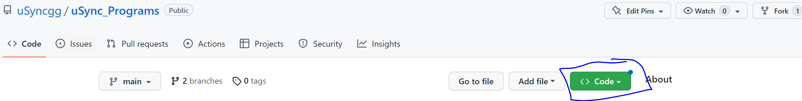
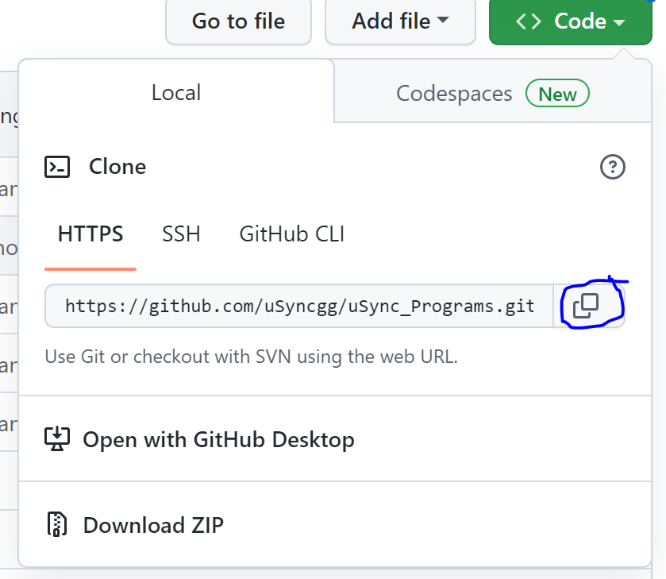

# uSync Programs
Usefull Programs

## Prerequisites

* Install Git (you can do so [here](https://git-scm.com/book/en/v2/Getting-Started-Installing-Git).)

## General Setup

1. Clone this GitHub repository

    How to clone this repository:

    1. In your file explorer (or Finder if you're on Mac), create a new folder wherever you would like.

    2. Copy the path to this new folder that you just created.

    3. Open a terminal (Windows: CMD, Powershell, or Windows Terminal) (Mac: Terminal).

    4. Use 'cd' to get to the directory of your new folder.  Ex:
        ```
        cd Documents/new_folder
        ```
    
    5. Go to the [uSync GitHub Repository](https://github.com/uSyncgg/uSync_Programs).

    6. Click on the green "Code" button at the top right.  It looks like this:
        
    
    7. Copy the https URL shown.  Here's what it looks like:
        
    
    8. Go back to the terminal you had open and type the following and paste the URL: 
        ```
        git clone <paste the url here>
        ```
    
    You have now cloned the repository.

2. In your file explorer (or Finder if you're on Mac) go to the directory where you cloned this repository.  Click on "homepage.html".

This will bring you to our website, and from here, you are free to roam!